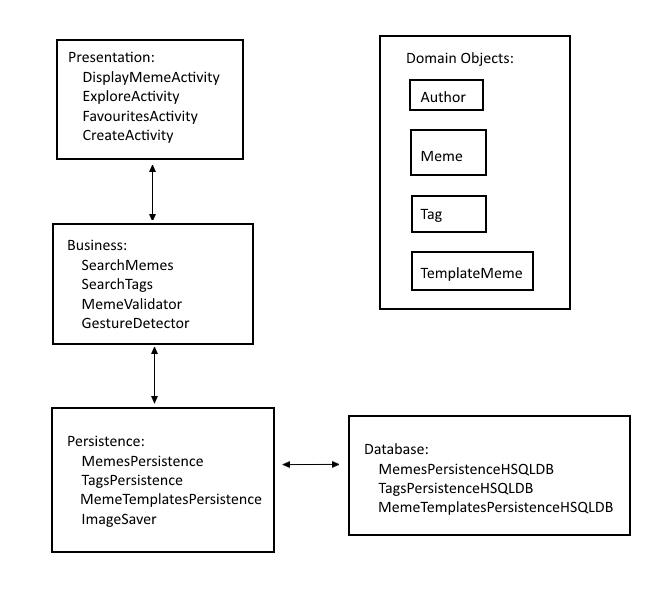

# Architecture.md

---

##### Description:

The app has 6 activities: `DisplayMemeActivity`, `ExploreActivity`, `FavouritesActivity`, `CreateActivity`, `SaveMemeActivity`, and `SelectTemplateActivity`. `DisplayMemeActivity` is for viewing a single meme in isolation. Through this activity, users are able to export memes to external storage and favourite a meme. `ExploreActivity` and `FavouritesActivity` are both for scrolling through a selection of memes. Memes that show up in the `FavouritesActivity` are ones that users favourite. `CreateActivity` is an editor for users to create their own memes. Through this activity, users are able to import memes into the app's internal database. `SaveMemeActivity` is for users to enter information about a meme their created, information such as name and tags. `SelectTemplateActivity` is for users to pick a template for their meme background.

The Persistence layer has 3 interfaces: `MemesPersistence`, `MemeTemplatesPersistence` and `TagsPersistence`. The database is accessed through these interfaces. Three primary domain objects exist `Meme`, `Tag`, `TemplateMeme`. `Meme` represents a meme stored in the database, with relevant meta data attached to it. One such data is a list of `Tags`. The `Tag` object represents a valid tag which can be attributed to a specific meme. `TemplateMeme` is similar to `Meme` however contains no `Tags`, and other meta data is different because a `TemplateMeme` is only used to help users create memes.

Meme creation sits primarily in the Presentation layer. The class `TextEntity` represents editable text that users put on their memes. The class `GestureDetector` helps with touch detection, for moving a `TextEntity` around. `CreateActivity` implements the class `TextEditorDialogFragment` which allows for the user to edit text. Meme creation has presence in the Business layer, in the `MemeValidator` class and the `InvalidMemeException` exception. Memes are validated depending on whether they fit certain criteria. `MemeValidator` is used in the `SaveMemeActivity` so that only valid memes are inserted into the database. And as for the Persistence layer, user created memes are added to the database. This happens through the `MemesPersistence` interface.

`ImageSaver` manages saving an image to the file system, externally and internally. It is useful for exporting memes and when saving user-created memes.

---
##### Diagram:

