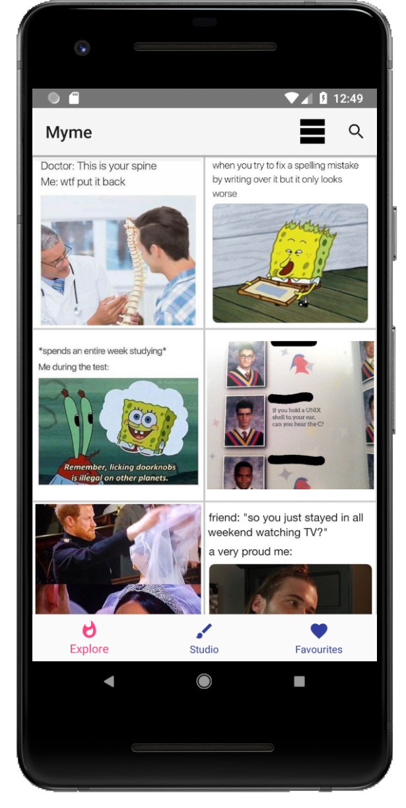

# Myme readme  

Myme is an app that provides users with a studio, in which they can easily explore, collect, and create memes, tailored to their tastes. 
Myme allows users to browse existing memes, and gives them the option to make new memes.

Explore                        | Detail                                 | Favorite                                    | Studio
:-----------------------------:|:--------------------------------------:|:-------------------------------------------:|:--------------------------:
 |   |   | 

## Running the app
You get started by cloning the project to your local machine:
` $ git clone https://github.com/NickJosephson/Myme.git `

You can also do this in Android Studio: on the top toolbar navigate to VCS > Git.

Before running the project in Android Studio, you might need to Sync Project with Gradle Files (File > Sync Project with Gradle Files)

## Relevant documents
* [Architecture](https://code.cs.umanitoba.ca/comp3350-summer2018/nitrogen/blob/master/Architecture.md)
* [Vision](https://code.cs.umanitoba.ca/comp3350-summer2018/nitrogen/blob/master/VISION.md)

